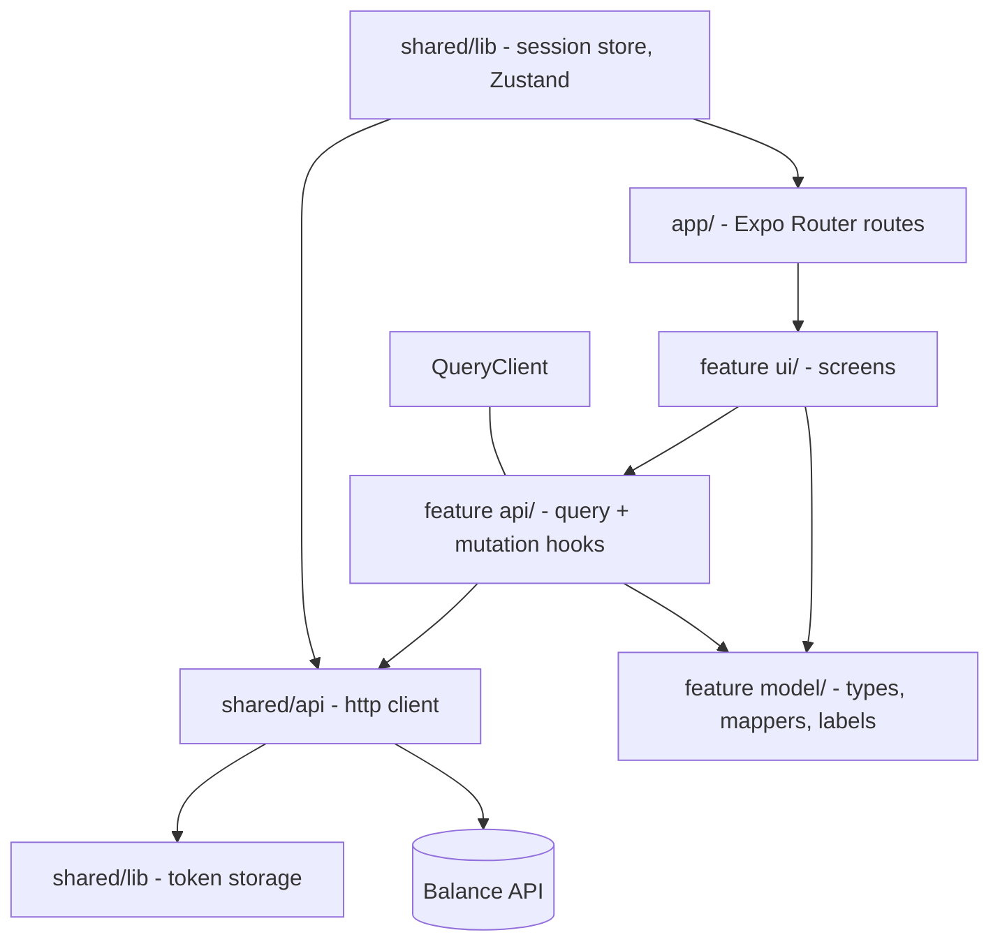

# Balance Mobile App Design

**Spec**: `.specs/features/balance-mobile-app/spec.md`
**Context**: `.specs/features/balance-mobile-app/context.md`
**Status**: Proposed

---

## Approach exploration

Three decisions carried real alternatives. Recording them so they are not relitigated later.

### Where the app's structure comes from

| Approach | Verdict |
| -------- | ------- |
| **Feature-first with thin layers (chosen)** | The user's choice. Each domain owns its `api`, `model` and `ui`; `shared/` holds only what two features genuinely use. Touching "expenses" means opening one folder. |
| Clean Architecture mirroring the backend | Rejected. The backend earns `domain/data/presentation` because real rules live there — competence month, version timelines, installment residue. None of it repeats here. The app's "use cases" would be one-line forwarders, which is structure without a rule to protect. |
| Type-first (plain Expo template) | Rejected. Fine at five screens; this app has around sixteen. |

### How server data is held

| Approach | Verdict |
| -------- | ------- |
| **TanStack Query (chosen)** | The user's choice. The app's actual state problem is *invalidation*: recording a payment must make the month re-read. Query solves that with `invalidateQueries` and gives caching, retry and loading state for free. |
| Zustand for everything | Rejected. Would mean hand-writing cache keys, staleness and refetch — reimplementing Query, worse. |
| Redux Toolkit + RTK Query | Offered and declined. Equivalent capability, more ceremony. |

Zustand still exists, holding exactly one thing: the session. That boundary is the whole point — anything derived from the server belongs to Query.

### What the tests actually test

The gate is Jest + React Native Testing Library. There is no emulator, so the honest statement of what is proven:

| Layer | Proven | Not proven |
| ----- | ------ | ---------- |
| Mappers, formatters, guards | Behaviour, fully | — |
| Query/mutation hooks | Request shape, cache invalidation, error mapping | Real network behaviour |
| Screens (RNTL) | Rendered text, states, user interaction wiring | Pixel layout, gestures, platform look |
| Navigation guard | Which route group renders for a session state | Native transitions |

**Nothing verifies iOS or Android rendering.** The spec says so in Out of Scope; the design repeats it because it is the single biggest limit of this delivery.

---

## Architecture Overview



The http client is the only module that knows about `fetch`, the base URL, the bearer header and the
error envelope. Nothing above it handles a raw `Response`.

### Folder layout

```
app/
  _layout.tsx                 QueryClientProvider + session bootstrap + route guard
  (auth)/sign-in.tsx  (auth)/sign-up.tsx
  (app)/_layout.tsx           tabs
  (app)/index.tsx             dashboard
  (app)/income/...            month, new source, payment, change value
  (app)/expenses/...          month, new expense, new installment plan
  (app)/recurring/...         list, new, payment, correct payment, change value
  (app)/catalogue/...         people, categories, accounts
src/
  features/auth|catalogue|income|expenses|recurring|dashboard/{api,model,ui}
  shared/
    api/     httpClient.ts, ApiError.ts, queryKeys.ts
    lib/     tokenStorage.ts, sessionStore.ts, money.ts, dates.ts
    ui/      Screen, Money, StatusBadge, EmptyState, ErrorState, Loading, Field, Picker
```

---

## Components

### `shared/api/httpClient.ts`

- **Purpose**: The single boundary to the API.
- **Interface**: `request<T>(method, path, body?): Promise<T>`, plus `get/post/put` helpers.
- **Behaviour**: attaches `Authorization: Bearer <token>` from the session store and
  `Accept-Language: pt-BR`; parses `{ errorMessages: [] }` into `ApiError` on 400; throws
  `UnauthorizedError` on 401; throws `NetworkError` when `fetch` itself rejects; returns `null` for 204.
- **Why it matters**: AUTH-03's "401 clears the session" and UX-02's "unreachable API says so" both
  live here, in one place, testable without a component.

### `shared/api/ApiError.ts`

`ApiError` (carries `messages: string[]`), `UnauthorizedError`, `NetworkError`. Screens branch on the
type, never on a status code.

### `shared/lib/tokenStorage.ts`

- `getToken`, `setToken`, `clearToken`.
- `expo-secure-store` on native; `localStorage` on web, where SecureStore has no implementation and
  would throw. The platform split lives here and nowhere else.

### `shared/lib/sessionStore.ts` (Zustand)

`{ token, name, status: 'loading' | 'signedIn' | 'signedOut', signIn, signOut, restore }`.
`status: 'loading'` exists so the route guard does not flash the sign-in screen while secure storage is
being read on cold start.

### `shared/lib/money.ts` and `dates.ts`

- `formatMoney(number)` → `R$ 1.234,56` via `Intl.NumberFormat('pt-BR')`.
- `parseMoneyInput(string)` → number or `null`, accepting `1234,56` and `1234.56`.
- `toApiDate(Date)` / `fromApiDate(string)` operating on `YYYY-MM-DD` **as a string**, never through a
  `Date` at UTC — that is how a date silently shifts by a day.
- `monthLabel`, `shiftMonth` for the month navigator.

### `shared/api/queryKeys.ts`

One factory per resource: `qk.dashboard(y, m)`, `qk.incomeMonth(y, m)`, `qk.expenseMonth(y, m)`,
`qk.people()`, `qk.categories()`, `qk.accounts()`. Centralised so a mutation invalidates the same key a
query registered — a typo'd string is the classic reason a screen does not refresh.

### Feature `api/` hooks

One hook per endpoint. Mutations declare their invalidation explicitly:

| Mutation | Invalidates |
| -------- | ----------- |
| `useRegisterIncomePayment` | `incomeMonth(refMonth)`, `dashboard(refMonth)` |
| `useRegisterExpense` | `expenseMonth(competenceMonth)`, `dashboard(competenceMonth)` — the month **the API returned**, not the one on screen |
| `useRegisterInstallmentPlan` | every month the returned installments touch, and their dashboards |
| `useRegisterRecurringPayment` / `useUpdateRecurringPayment` | `expenseMonth(refMonth)`, `dashboard(refMonth)` |
| `useArchiveRecurringExpense` | every `expenseMonth` and `dashboard` — archiving changes past and future months alike |
| `useCreateCategory` / `useCreateAccount` / `useCreatePerson` | its own list |

**EXP-03 hangs on that second row.** Registering a credit expense past the closing day returns a
competence month different from the one being viewed; invalidating the visible month would refresh a
list the expense is not in, and the user would think it vanished. The response's `competenceMonth` is
what drives both the invalidation and the "landed in September" message.

### Feature `model/`

Types mirroring the API contracts, plus label maps kept apart from components:

```ts
IncomeStatus  = 0 Pending  | 1 Received | 2 Divergent   → Pendente | Recebido | Divergente
ExpenseStatus = 0 Pending  | 1 Paid     | 2 Divergent   → Pendente | Pago     | Divergente
ExpenseType   = 0 Credit   | 1 Debit    | 2 Pix
ExpensePriority = 0 Essential | 1 Important | 2 Superfluous
IncomeType    = 0 Recurring | 1 Variable
```

Income and expense share integers and differ in words — `Received` vs `Paid`. Two separate maps, never
one shared map, so a rename on one side cannot silently retitle the other.

### `shared/ui/`

`Screen`, `Loading`, `EmptyState`, `ErrorState` (message + retry), `Money`, `StatusBadge`, `Field`,
`Picker`, `MonthNavigator`, `SubmitButton` (disabled while pending — UX-02 AC4). Every list screen is
built from the same four states so UX-01 is structural rather than remembered per screen.

---

## Data flow of the two screens that carry the model

**Monthly expense screen** renders `GET /api/expense/{y}/{m}` directly: `variableLines` in one section,
`recurringLines` in another. A recurring line shows `expectedAmount` when `actualAmount` is null,
marked provisional if `isEstimate`; once `actualAmount` arrives it shows that instead. No arithmetic
happens on the client — `totalCommitted` comes from the API.

**Recording a bill's real cost** branches on whether the line already has an `actualAmount`:
absent → `POST /payment`; present → `PUT /payment/{id}`. That branch is REC-03 AC4, and it exists so
the user never meets `PAYMENT_ALREADY_RECORDED` as a dead end. The payment id needed by `PUT` is not on
the monthly line, so the correction screen is reached from the line and takes the id from the POST
response cached by Query, or refetches the month when absent.

> **Open risk, recorded rather than hidden:** `ResponseRecurringExpenseLineJson` carries the amounts and
> status but **not the payment's id**. The correction flow therefore needs one of: (a) the API adding
> `paymentId` to the line, (b) a GET for a single payment, or (c) the app caching the id from its own
> POST — which fails after an app restart. **(c) is what this delivery implements**, and the limit is
> explicit: correcting a payment recorded on a previous run of the app is not reachable until the API
> exposes the id. This is a backend gap the app cannot paper over; it is written into the spec's
> Out of Scope as a known limit rather than silently half-working.

---

## Error Handling Strategy

| Scenario | Handling | User sees |
| -------- | -------- | --------- |
| 400 validation | `ApiError.messages` rendered under the form | The API's own pt-BR messages |
| 401 on an authorised route | `UnauthorizedError` → session cleared → guard redirects | Sign-in screen |
| 404 | Treated as "not found", never as "forbidden" (backend AD-004) | "Não encontrado" |
| `fetch` rejects | `NetworkError` | "Não foi possível conectar" + retry |
| 500 | Generic error state + retry | "Algo deu errado" + retry |

The client validates only emptiness and number format. Every rule the API owns stays there — a
duplicated rule is a rule that can disagree with itself.

---

## Testing Strategy

| Layer | Tool | What it asserts |
| ----- | ---- | --------------- |
| `money`, `dates`, mappers, label maps | Jest | Pure behaviour, every branch |
| `httpClient` | Jest + mocked `fetch` | Header attachment, error-type mapping, 204 handling |
| Query/mutation hooks | Jest + RNTL `renderHook` + a test `QueryClient` | Request payload shape and which keys are invalidated |
| Screens | RNTL | Loading / empty / error / data states, and what a press sends |
| Route guard | RNTL | Which group renders for each session status |

**Lessons carried from the backend** (all still candidates there; applied here on purpose):

- **L-004** — assert every pass-through field a projection copies. A wrong `dueDay` shipped in the
  backend because totals were asserted and the field was not. Screen tests assert the fields the user
  reads, not only the totals.
- **L-005** — every status branch gets a fixture, including the null-expected one.
- **L-003** — a criterion naming two outputs gets two assertions.
- **L-010** — never compute an expected value with the implementation's own helper. Money and date
  assertions use literals: `formatMoney(1234.56)` is asserted to equal `'R$ 1.234,56'`, not
  `Intl.NumberFormat(...).format(1234.56)`.

---

## Risks & Concerns

| Concern | Impact | Mitigation |
| ------- | ------ | ---------- |
| No emulator in this session | Nothing proves the app renders on iOS or Android | Stated in spec Out of Scope; `expo start --web` is the agent's only rendering check; the user runs Expo Go |
| Recurring payment id absent from the monthly line | Correcting a payment from a previous session is unreachable | Recorded above as an open risk and in the spec's Out of Scope, not worked around silently |
| CORS allows only `localhost:5173` | Expo web cannot call the API | One backend commit adds the Expo web origin. Device builds need no CORS at all |
| Device cannot reach `localhost` | The app appears broken on a phone | `EXPO_PUBLIC_API_URL` documented in the README; only the user knows their LAN IP |
| Token expires after 60 minutes, no refresh endpoint | A silent 401 mid-session | `UnauthorizedError` clears the session and routes to sign-in — visible, not silent |
| `expo-secure-store` has no web implementation | The web build throws on start | Platform split inside `tokenStorage.ts`, with a test for each branch |
| `Date` parsing shifts a day across timezones | An expense recorded on the wrong day | Dates handled as `YYYY-MM-DD` strings end to end; unit-tested with a non-UTC `TZ` |
| Query cache survives sign-out | Account A's data visible to account B | `signOut` calls `queryClient.clear()`; asserted by a test |
| Expo SDK moves fast | The scaffold pins whatever is current at creation | The scaffold task records the exact SDK and RN version it produced |

---

## Tech Decisions

| Decision | Choice | Rationale |
| -------- | ------ | --------- |
| Structure | Feature-first, thin layers | User's choice; matches where change actually lands |
| Server state | TanStack Query | Invalidation is the app's real problem |
| Client state | Zustand, session only | Everything else is server-derived |
| Styling | `StyleSheet` | User's choice; no build-step dependency |
| Navigation | Expo Router with `(auth)` / `(app)` groups | Guard is one layout, not a check per screen |
| Competence month | Always the server's | One rule, one implementation |
| Error copy | The API's messages verbatim | Already localised; duplication invites disagreement |
| Money in tests | Literal expected strings | Lesson L-010 |
| Token on web | `localStorage` fallback | SecureStore is native-only |
