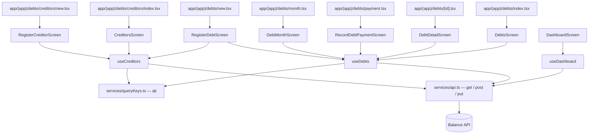

# Debt Tracking (Mobile) Design

**Spec**: `.specs/features/debt-tracking/spec.md`
**Backend spec**: `../backend/.specs/features/debt-tracking/spec.md`
**Status**: Awaiting approval

A feature slice following the shape the app already has: types in `src/types`, endpoint wrappers and
query keys in `src/services`, one hook module in `src/hooks`, one folder per screen in `src/screens`,
and thin route files in `app/(app)`. No new dependency.

> **Reconciled against the shipped backend on 2026-08-28**, after `feature/debt-tracking` merged.
> This document was written before the API existed, and the API drifted while it was built. What
> changed here:
>
> - `MonthlyDebtLine.debtName` → `name`; the line also gained `mode`, `paymentDate` and `notes`.
> - Routes moved to the PascalCase the app already uses for `/RecurringExpense`. Casing is not
>   load-bearing — ASP.NET route matching ignores it — but the hyphen in `recurring-expense` was,
>   and 51 backend tests died on exactly that. Consistency here is cheap insurance.
> - A payment now must carry an installment id for a `Scheduled` debt and must not for an
>   `OpenEnded` one (`DEBT_INSTALLMENT_ID_REQUIRED` / `DEBT_INSTALLMENT_ID_NOT_ALLOWED`).
> - An installment count of 1 is valid for a debt (`DEBT_INSTALLMENT_COUNT_INVALID`), unlike an
>   installment plan, which still requires 2.
> - `GET /Debt` returns `installments: []` on every row.
>
> One gap was found here and fixed in the backend rather than worked around: the monthly line
> carried `installmentNumber` but no `installmentId`, so a client could not pay the line it was
> looking at without fetching the whole debt first. `MonthlyDebtLine.installmentId` exists as of
> backend branch `fix/monthly-debt-line-installment-id` — **this plan depends on that branch being
> merged**.

---

## Approach exploration

### Where the debt screens live in navigation

Three placements were considered. Under `expenses/` it would read as a kind of expense, which is what
the backend design deliberately refused - a debt installment is an obligation, not a purchase, and
users would look for it where its total is summed. As a tab of the dashboard it would be invisible
until the dashboard is open, and the debt list is a destination in its own right ("what do I owe my
father"). As a sibling route group `app/(app)/debts/`, alongside `expenses` and `income`, it matches
what the thing is and costs nothing extra. That is the choice.

### Why the app computes nothing

MAD-001 already says the app owns no business rule, and debt is where that is most tempting to
break: outstanding balance is one subtraction, and "overdue" is one date comparison. Both are already
returned by the API. Recomputing either would produce a second source of truth that disagrees with
the first the moment a payment is corrected, and the disagreement would be invisible - two plausible
numbers, no crash. Every balance, settled flag, status and overdue marker is rendered from the
response.

The success criterion is written to be checkable: searching the app's source for a debt balance
computation must return nothing.

### Why a payment invalidates a prefix, not a month

MAD-003 scopes an invalidation to the month the API returned, and for a recurring payment that is
exactly right - a bill's cost in August says nothing about September. A debt payment is different:
it moves the outstanding balance, which appears on the debt detail, in the list, in the creditor
summary and, indirectly, in every later month the user might already have cached. Invalidating one
month would leave the detail screen showing a balance the payment already changed.

So a debt write invalidates `debtMonths()` and `dashboards()` as prefixes, plus the specific debt and
the creditor summary. This is the same reasoning that already made archiving a recurring bill
invalidate `expenseMonths()` rather than one month - the precedent exists, and this is a second
instance of it, not a new rule.

### Registration form: one form, two shapes

`Scheduled` and `OpenEnded` differ by two fields. A second screen would duplicate the creditor
picker, the person picker, the category picker and both amount fields to vary two inputs. One form
with a mode control that **hides** the schedule fields is smaller and cannot send a combination the
API rejects - hiding rather than disabling matters, because a disabled field still suggests the
combination is meaningful and the API answers `SCHEDULE_NOT_ALLOWED` when it is not.

---

## Architecture Overview



### Folder layout

```
app/(app)/debts/
  _layout.tsx            stack, Portuguese titles
  index.tsx              → DebtsScreen
  month.tsx              → DebtMonthScreen
  new.tsx                → RegisterDebtScreen
  payment.tsx            → RecordDebtPaymentScreen
  [id].tsx               → DebtDetailScreen
  creditors/index.tsx    → CreditorsScreen
  creditors/new.tsx      → RegisterCreditorScreen

src/types/debt.ts        Debt, DebtInstallment, DebtPayment, MonthlyDebt, DebtMode
src/types/creditor.ts    Creditor, CreditorType, CreditorSummary
src/hooks/useDebts.ts    every debt query and mutation
src/hooks/useCreditors.ts
src/screens/Debts/            DebtsScreen.{tsx,styles.ts,test.tsx}
src/screens/DebtMonth/        DebtMonthScreen.{tsx,styles.ts,test.tsx}
src/screens/DebtDetail/       DebtDetailScreen.{tsx,styles.ts,test.tsx}
src/screens/RegisterDebt/     RegisterDebtScreen.{tsx,styles.ts,test.tsx}
src/screens/RecordDebtPayment/ RecordDebtPaymentScreen.{tsx,styles.ts,test.tsx}
src/screens/Creditors/        CreditorsScreen.{tsx,styles.ts,test.tsx}
src/screens/RegisterCreditor/ RegisterCreditorScreen.{tsx,styles.ts,test.tsx}
```

Route files stay thin - one import and one render, as every existing route file in `app/(app)` does.
The screens hold the behaviour and the tests.

---

## Components

### `src/types/creditor.ts`

```ts
export type CreditorType = 'Person' | 'Institution' | 'Other';

export type Creditor = {
  id: string;
  name: string;
  type: CreditorType;
  contact: string | null;
  notes: string | null;
  archived: boolean;
};

export type CreditorSummary = {
  creditor: Creditor;
  unsettledDebtCount: number;
  totalOwed: number;
  totalPaid: number;
  outstandingBalance: number;
};
```

### `src/types/debt.ts`

```ts
export type DebtMode = 'Scheduled' | 'OpenEnded';

export type DebtInstallment = {
  id: string;
  number: number;
  referenceMonth: string;       // YYYY-MM-DD, first of the month
  dueDate: string;              // YYYY-MM-DD
  expectedAmount: number;
  amountPaid: number | null;
  paymentId: string | null;
  status: ExpenseStatus;        // reused from '@/types/expense'
};

export type DebtPayment = {
  id: string;
  debtId: string;
  debtInstallmentId: string | null;
  referenceMonth: string;
  paymentDate: string;
  amountPaid: number;
  type: ExpenseType | null;
  accountId: string | null;
  accountName: string | null;
  notes: string | null;
};

export type Debt = {
  id: string;
  name: string;
  mode: DebtMode;
  creditorId: string;
  creditorName: string;
  creditorType: CreditorType;
  personId: string;
  categoryId: string;
  categoryName: string;
  principalAmount: number;
  totalAmount: number;
  startDate: string;
  dueDay: number | null;
  installmentCount: number | null;
  endMonth: string | null;
  archived: boolean;
  notes: string | null;
  outstandingBalance: number;   // from the API. Never recomputed (MAD-001)
  isSettled: boolean;           // from the API. Never recomputed
  installments: DebtInstallment[];
  payments: DebtPayment[];
};

export type MonthlyDebtLine = {
  debtId: string;
  name: string;                 // the debt's name. The API calls it `name`, not `debtName`
  mode: DebtMode;
  creditorId: string;
  creditorName: string;
  creditorType: CreditorType;
  personId: string;
  categoryId: string;
  categoryName: string;
  installmentId: string | null; // what the payment screen needs; null on an open-ended line
  installmentNumber: number | null;
  installmentCount: number | null;
  dueDate: string | null;
  expectedAmount: number | null;
  amountPaid: number | null;
  paymentDate: string | null;
  paymentId: string | null;
  type: ExpenseType | null;
  accountId: string | null;
  accountName: string | null;
  notes: string | null;
  status: ExpenseStatus;
  isOverdue: boolean;           // from the API. Never recomputed
};

export type MonthlyDebt = {
  competenceMonth: string;
  lines: MonthlyDebtLine[];
  totalExpected: number;
  totalPaid: number;
  totalCommitted: number;
};
```

`ExpenseStatus` and `ExpenseType` are imported from `@/types/expense`, not redeclared - the API
reuses the same two enums and a second copy would drift.

### `src/services/queryKeys.ts`

Six factories appended to `qk`, each with the doc-comment style the file already uses:

```ts
debts: (creditorId: string | null, personId: string | null, includeInactive: boolean) =>
  ['debts', creditorId, personId, includeInactive] as const,
debtsAll: () => ['debts'] as const,
debt: (id: string) => ['debt', id] as const,
debtMonth: (year: number, month: number) => ['debtMonth', year, month] as const,
debtMonths: () => ['debtMonth'] as const,
creditors: (includeArchived: boolean) => ['creditors', includeArchived] as const,
creditorsAll: () => ['creditors'] as const,
creditorSummary: (id: string) => ['creditorSummary', id] as const,
```

The filtered listing takes its filters as key parts for the same reason `expenseMonth` takes the
year and the month: a factory that ignored an argument would make every filter share one cache entry,
and filtering by one creditor would appear to change the unfiltered list.

### `src/hooks/useCreditors.ts`

| Export | Kind | Endpoint | Invalidates |
| ------ | ---- | -------- | ----------- |
| `useCreditors(includeArchived)` | query | `GET /Creditor?includeArchived=` | — |
| `useCreditorSummary(id)` | query | `GET /Creditor/{id}/summary` | — |
| `useRegisterCreditor()` | mutation | `POST /Creditor` | `creditorsAll()` |
| `useArchiveCreditor()` | mutation | `PUT /Creditor/{id}/archive?archived=` | `creditorsAll()`, `debtsAll()` |

### `src/hooks/useDebts.ts`

| Export | Kind | Endpoint | Invalidates |
| ------ | ---- | -------- | ----------- |
| `useDebts(filters)` | query | `GET /Debt?creditorId=&personId=&includeInactive=` | — |
| `useDebt(id)` | query | `GET /Debt/{id}` | — |
| `useDebtMonth(year, month)` | query | `GET /Debt/{year}/{month}` | — |
| `useRegisterDebt()` | mutation | `POST /Debt` | `debtsAll()`, `debtMonths()`, `dashboards()` |
| `useRecordDebtPayment()` | mutation | `POST /Debt/payment` | `debt(debtId)`, `debtsAll()`, `creditorSummary(creditorId)`, `debtMonths()`, `dashboards()` |
| `useCorrectDebtPayment()` | mutation | `PUT /Debt/payment/{id}` | the same five |
| `useArchiveDebt()` | mutation | `PUT /Debt/{id}/archive?archived=` | `debtsAll()`, `debtMonths()`, `dashboards()` |

Input types are declared beside each mutation, as `useRecurring.ts` does:

```ts
export type RegisterDebtInput = {
  name: string;
  creditorId: string;
  personId: string;
  categoryId: string;
  mode: DebtMode;
  principalAmount: number;
  totalAmount: number;
  startDate: string;                 // YYYY-MM-DD
  installmentCount: number | null;   // null when mode is OpenEnded
  dueDay: number | null;             // null when mode is OpenEnded
  notes: string | null;
};

export type RecordDebtPaymentInput = {
  debtId: string;
  debtInstallmentId: string | null;
  paymentDate: string;
  amountPaid: number;
  type: ExpenseType | null;
  accountId: string | null;
  notes: string | null;
};

export type CorrectDebtPaymentInput = {
  paymentId: string;
  paymentDate: string;
  amountPaid: number;
  type: ExpenseType | null;
  accountId: string | null;
  notes: string | null;
};
```

`RecordDebtPaymentInput` carries no reference month: the API derives it, and a field here would be a
way for the app to contradict the schedule it is paying.

### Screens

Every screen composes the existing primitives rather than new ones - `Screen`, `Loading`,
`EmptyState`, `ErrorState` from `src/components/states`, and `Field`, `DateField`, `Picker`,
`OptionChips`, `SelectSheet`, `SubmitButton` from `src/components/form`. `Money` renders every
amount. No new shared component is introduced except `DebtStatusBadge`, below.

| Screen | Responsibility |
| ------ | -------------- |
| `DebtsScreen` | The debt list with creditor and person filters and an inactive toggle (`ArchiveToggle` is reused). Rows show name, creditor, outstanding balance and progress as paid-of-total. `GET /Debt` returns `installments: []` on every row, so a row cannot show schedule detail — `installmentCount` and the balance are what it has. Do not read `installments` here |
| `DebtMonthScreen` | The month's lines, its three totals, month navigation matching `ExpenseMonthScreen` |
| `DebtDetailScreen` | One debt: header with balance and settled state, the schedule, the payments, an archive action, and a press on an installment routing to the payment screen |
| `RegisterDebtScreen` | The one form with the mode control; on success, states how many installments were created, the amount of each and the first month, all from the response |
| `RecordDebtPaymentScreen` | Amount, date, type, account, notes. Requires an account when the type is Crédito. Requires an installment for a `Scheduled` debt and forbids one for an `OpenEnded` debt. Routes to correction when the installment already carries a payment |
| `CreditorsScreen` | List with an archive action, and a summary press |
| `RegisterCreditorScreen` | Name, type, contact, notes |

### `src/components/DebtStatusBadge.tsx`

The only new shared component. Renders `Pendente` / `Pago` / `Divergente` from the API's `status`,
plus a distinct overdue marker driven by `isOverdue`. It is a separate marker rather than a fourth
label because the API models overdue as a boolean and not as a status - the badge must not invent a
state the backend does not have.

### Dashboard

`src/types/dashboard.ts` gains `debts: MonthlyDebt` on the dashboard response type, and
`DashboardScreen` gains a fourth block showing `totalCommitted` with its paid share, pressable to
`app/(app)/debts/month`. `balance` is still rendered exactly as the API returned it - the subtraction
already happened on the server.

---

## Error Handling Strategy

| Error Scenario | Handling | User Impact |
| -------------- | -------- | ----------- |
| Validation rejection (400) | `ApiError` from `httpClient`; the screen renders `error.messages` | The API's pt-BR message, verbatim (MAD-004), form still filled |
| Not found (404) | `ApiError` with the API's message | Same treatment; the screen offers a way back |
| Expired token (401) | `UnauthorizedError`; the existing handler clears the session | Return to sign-in, no broken screen |
| API unreachable | `NetworkError` | The connectivity message, never a validation message (UX AC5) |
| Credit payment with no account | Blocked in the form before sending, **and** the API's `ACCOUNT_REQUIRED_FOR_CREDIT` shown if it still arrives | The user is not made to round-trip for a rule the form knows |
| Payment already recorded for an installment | The detail screen routes to correction instead of offering a second payment; if the API still answers `PAYMENT_ALREADY_RECORDED`, that message is shown | No duplicate row, no silent failure |
| A payment whose installment does not match the debt's mode | The screen never offers the combination: a `Scheduled` debt is always paid through one of its installments, an `OpenEnded` one never is. The API answers `DEBT_INSTALLMENT_ID_REQUIRED` / `DEBT_INSTALLMENT_ID_NOT_ALLOWED` if it still arrives | An installment-less payment on a scheduled debt would move the balance while appearing in no month at all - the backend closed that door, and the app must not knock on it |

The credit-without-account check is the one client-side rule in this feature, and it is a duplicate
of a server rule rather than a replacement for it - the same latitude the spec already grants for
emptiness and number format. Everything else is the server's.

---

## Testing Strategy

| Layer | What it proves |
| ----- | -------------- |
| Types and mappers | Nothing to test - the types carry no behaviour. `DebtStatusBadge`'s label map is tested with literal strings, never by recomputing the map in the assertion (lesson **L-010**) |
| Hooks (`renderHook` + a test `QueryClient`) | The exact request payload sent, and **which query keys are invalidated**. A mutation test asserting only success proves nothing about a screen refreshing |
| Screens (React Native Testing Library) | Loading, empty, error and data states; the fields a user actually reads - not just totals (lesson **L-004**); what a press sends |

Two assertions carry the feature's central claim and are named explicitly in the tasks: a debt
detail screen renders the API's `outstandingBalance` **unchanged** when it disagrees with the sum of
the payments in the same fixture, and a month line renders `isOverdue` from the response with a due
date in the future. Both fail if the app ever starts computing these itself.

---

## Risks & Concerns

| Concern | Location | Impact | Mitigation |
| ------- | ------- | ------ | ---------- |
| Recomputing the balance "just for display" | `DebtDetailScreen`, `DebtsScreen` | Two sources of truth that disagree after a correction, with no crash to reveal it | The detail test fixture deliberately carries a total, payments and an `outstandingBalance` that do **not** reconcile, and asserts the API's value is what appears |
| Recomputing `isOverdue` from the due date | `DebtMonthScreen` | A test that passes in one month and fails in the next | The fixture's due date is in the future while `isOverdue` is true; the screen must show overdue |
| Invalidating one month after a payment | `useDebts` | The detail screen keeps a stale balance; the user records a payment and sees nothing change | The hook tests assert the full invalidation set by key, not just mutation success |
| `installments` assumed ordered | `DebtDetailScreen` | The backend now guarantees the order, but an assumption here would break silently if that ever regressed | The screen renders in the order received and the test fixture's array is already ordered; ordering is the backend's assertion, not duplicated here |
| Filter arguments dropped from a query key | `queryKeys.ts` | Filtering by one creditor appears to change the unfiltered list | Each filter is a key part, and a key-factory test asserts two different filters produce two different keys |
| The register form sending a schedule for an open-ended debt | `RegisterDebtScreen` | 400 `SCHEDULE_NOT_ALLOWED` on a combination the UI allowed | The mode control hides the fields and the submit handler sends nulls; a screen test switches mode and asserts the payload |

---

## Tech Decisions

| Decision | Choice | Rationale |
| -------- | ------ | --------- |
| Navigation | A `debts` route group under `(app)`, sibling to `expenses` and `income` | A debt is not an expense; the backend design refused that conflation and the app should not reintroduce it |
| Business rules | None on the client | MAD-001, and the success criterion is written to be grep-checkable |
| Invalidation scope | Prefixes for the month and the dashboard, plus the specific debt and creditor summary | A payment moves a balance that appears on four surfaces; the recurring-archive precedent already establishes prefix invalidation |
| Schedule and open-ended | One form with a mode control that hides fields | Hiding cannot send what the API rejects; disabling would still imply the combination is meaningful |
| Overdue | A marker beside the status badge, never a fourth status | The API models it as a boolean; matching that keeps the two vocabularies aligned |
| Status wording | Pendente / Pago / Divergente | Already learned by the user from recurring bills |
| New shared components | `DebtStatusBadge` only | Everything else composes existing form and state primitives |
| Client-side validation | Emptiness, number format, and credit-requires-account | The third duplicates a server rule to save a round trip; it never replaces it |
| Types for status and payment type | Imported from `@/types/expense` | The API reuses those enums; a second copy would drift |
| Dependencies | None added | Every screen composes what the app already ships |
